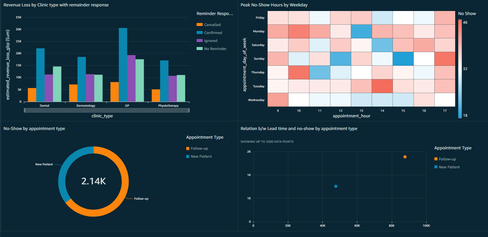

# AWS Serverless Healthcare Data Pipeline: Clinic Congestion Analyzer

## Project Overview
This project implements an end-to-end, event-driven Data Engineering pipeline on AWS, designed to process and analyze healthcare clinic appointment data. The primary objective is to ingest raw appointment records, execute real-time transformations using a serverless compute architecture, and prepare the dataset for Business Intelligence (BI) visualization. The resulting data model enables operational analysis of patient no-show rates and associated revenue leakage.

## Architecture & AWS Services
This pipeline utilizes a fully serverless architecture to minimize operational overhead and ensure zero idle compute costs.
* **Amazon S3:** Serves as the primary Data Lake, structured with `raw-data` (landing zone) and `processed-data` (curated zone) directories.
* **AWS Lambda:** Acts as the serverless compute engine, executing a Python-based ETL (Extract, Transform, Load) script upon data ingestion.
* **AWS IAM:** Enforces strict least-privilege access control, utilizing custom execution roles for Lambda and cross-region logging.
* **Amazon CloudWatch:** Provides comprehensive monitoring, logging, and timeout debugging for the pipeline's execution environment.
* **Amazon Athena & Amazon QuickSight:** (Phase 2) Serverless query engine and BI dashboarding for end-user analytics.

## ETL Pipeline Execution
The ingestion of a raw CSV file into the S3 `raw-data/` directory automatically triggers the AWS Lambda function. The Python script performs the following data transformations:

1. **Schema Standardization:** Normalizes headers by stripping whitespace, converting to lowercase, and replacing spaces with underscores.
2. **Data Scrubbing:** Automatically filters and drops incomplete records (e.g., missing mandatory fields such as patient age or distance to clinic).
3. **Boolean Mapping:** Converts text-based binary indicators into integers (1/0) to optimize aggregations in the BI layer.
4. **Feature Engineering:** Dynamically calculates a new `lead_time_days` metric by measuring the delta between the `scheduled_date` and `appointment_date`.
5. **Data Loading:** Writes the transformed, BI-ready dataset into the S3 `processed-data/` directory.

## Business Intelligence & Visualization
The processed dataset is linked to Amazon QuickSight via Amazon Athena. Key metrics visualized in the final dashboard include:

* **Revenue Leakage Analysis:** A bar chart aggregating estimated_revenue_loss_gbp by clinic and appointment type.
* **Temporal Heat Maps:** Identification of "Danger Zones" by mapping no-show volumes against appointment hour and day of the week.
* **Patient Demographics:** Donut charts segmenting no-show probabilities by gender and chronic condition status.
* **Lead Time Correlation:** Scatter plots analyzing the relationship between booking advance time and the likelihood of a missed appointment.

  
## Technical Challenges & Solutions
* **Recursion Prevention:** Engineered conditional logic within the Lambda handler to verify the S3 object prefix, preventing infinite execution loops caused by the `put_object` event.
* **Compute Optimization:** Profiled the function's memory usage and execution time, manually adjusting Lambda timeout thresholds to successfully process larger datasets.
* **IAM Policy Debugging:** Diagnosed silent execution failures by identifying implicit region restrictions in CloudWatch; resolved by attaching the `AWSLambdaBasicExecutionRole` policy to grant broader logging permissions.

